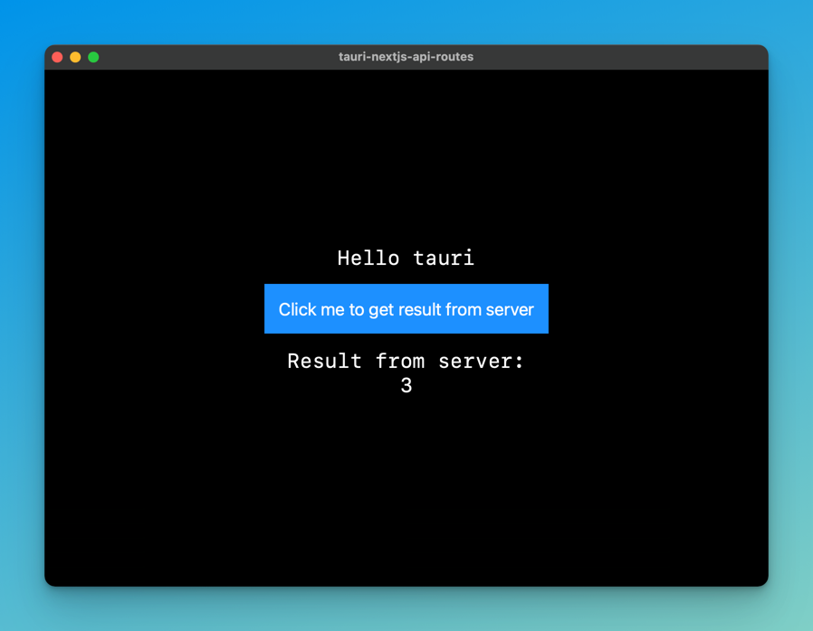
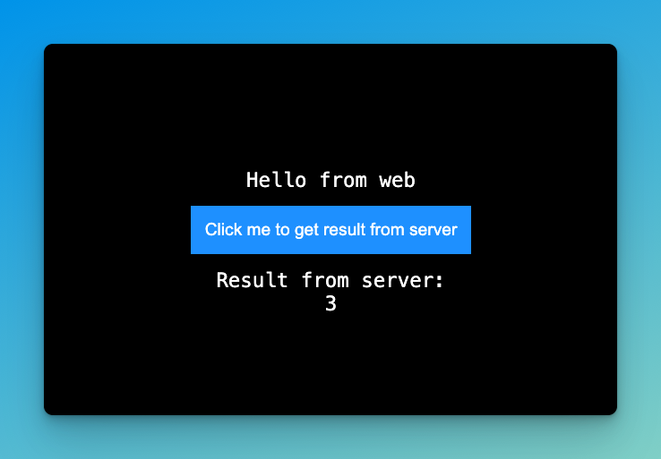

# Next JS with Tauri Example

This repo demonstrates how you can use Next JS and Tauri together to build an application which can be deployed on the web, and also packaged up as a desktop application.
Since Tauri usually doesn't support NextJS API routes, this example shows how to share code and logic between NextJS API routes and a local server used in the Tauri application.

To achieve this, the `pkg` package is used to package up a node server as a binary. This binary is then used as a sidecar in the Tauri application.
For simplicity, I decided to write the server using express, but you can use any server you want. 

## Screenshot
### Tauri


### Web



## Getting Started

1. Clone the repo `git clone git@github.com:srsholmes/tauri-nextjs-api-routes.git`.
2. Install dependencies using `npm install` or `yarn` or `pnpm install`.

## To run NextJS Application:

```bash
npm run dev # or yarn dev
```

## To run the Tauri application (dev):

```bash
npm run tauri dev # or yarn tauri dev
```

## To build the Tauri application:

```bash
npm run tauri build # or yarn tauri build
```

## To build the server for tauri:

```bash
npm run package:server # or yarn package:server 
```

## Architecture

- The Next JS application is run using `npm run dev` and is available at `http://localhost:3000`.
- The Tauri application is run using `npm run tauri dev`. The Tauri application uses the `pkg`-generated binary to run a local server on the user's machine.
- The NextJS API routes are normally not supported by Tauri, but by running the local server as a sidecar using the binary generated by `pkg`, the Tauri application is able to access the routes and their functionality.
- Shared code between Tauri and NextJS is located in the `src/shared` directory, while code for NextJS API routes and pages is located in the `pages/api` directory.
- The tauri server is located in the `server` directory.

## Technologies Used

- [Next JS](https://nextjs.org/)
- [Tauri](https://tauri.studio/)
- [pkg](https://github.com/vercel/pkg)

## License

MIT
